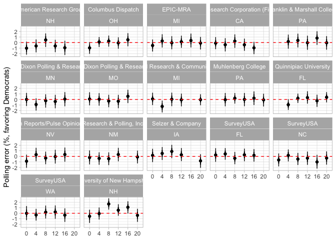

Polling error and predictability
================

One way of thinking about polling error is to think of it as being
composed of an average component and a unique component that is specific
to every polling firm. Polling error is in some sense obviously
undesirable and the general consensus is – one might say with some
further qualifiers to be imagined – that you can neither predict polling
error nor where the individual polling houses will fall. Further – and
this appears to be more generally true than the preceding statement –
polling firm specific errors are generally modeled as random effects
that are the same for each state. That is expecting past on past data or
modeling based on current data, we would say that polling firm A has a
2.5% error favoring the Democratic candidate in all states from Alaska
to Wyoming (or some more sensible sorting like DC to Wyoming).

Here, I want to present some modeling to assess the extent to which
these statements are reflected in the observed data. That is

1.  Are polling house errors constant across states during each
    election?

2.  Can the average error be predicted from year to year?

There is obviously the issue of “Can I fit this?” with respect to
allowing interactions between polling houses and states or phrased
differently saying that polling house errors are state-specific with
maybe some structure behind it. But then again even knowing that
something – here assuming that polling house errors don’t vary across
states – is a simplification can be useful. And then again with the
right prior structure there is little one can’t fit.

## Polling Error and so forth

Here some general description about how this is approached. I take polls
from the last three weeks of polling before the general election at the
state level from 2000 to 2020 variously collected from
\[FiveThirtyEight\]\[<https://github.com/fivethirtyeight/data/tree/master/pollster-ratings>\]
and those that \[Elliott\]\[<https://gelliottmorris.com>\] presumably
scraped from HuffPost for our forecasting model last year. The common
belief is that polls don’t move that much over the last weeks as voters
have made up their mind.

As the final outcomes are observed in each case, we can fit

*y*<sub>*i*</sub> ∼ Binomial(*n*<sub>*i*</sub>, *α*<sub>*s*\[*i*\]</sub> + *ξ*<sub>*i*</sub>)

with *n*<sub>*i*</sub> being two-party respondents of the poll,
*y*<sub>*i*</sub> Democratic respondents, *α*<sub>*s*</sub> the election
outcome in state *s* in terms of the Democratic voteshare and
*ξ*<sub>*i*</sub> the polling error of that poll (favoring the
Democratic candidate). As a small intermission, I really really dislike
seeing people ignore sampling variation in their evaluation of how
pollster do. Some statements you just can’t make and making them
conditional on ignoring that variation shouldn’t be anyone’s first
choice.

We can split up *ξ*<sub>*i*</sub> into multiple components and here I
include a national, regional, division, and state component and all
their interactions with the election year. Lots of parameters. The end
result is that observed variation is split up between all these levels.
Which gets you some nice plots and some that are barely legible. Yet,
beyond that we can also add a polling house - year - state component.
What this term ultimately does is to capture polling house specific
deviations from the observed polling error average at the state level in
each year. To an extent this term is equivalent to the polling house
intercepts in our forecasting model after adjusting for the average
error.

The Stan model used here has an autoregressive component for the second
question but this doesn’t matter inference wise as it gives almost
identical inference to a model that fits all the components separately
with a hierarchical prior.

``` stan
data {
  int N;
  int S; // State
  int R; 
  int D; 
  int T; 
  int P;
  int p[N];
  int rt[N];
  int dt[N];
  int t[N];
  int x[N];
  int y[N];
  int n[N];
  vector[N] outcome;
  int pred_r[S];
  int pred_d[S];
}
transformed data {
  vector[N] logit_outcome;
  logit_outcome = logit(outcome);
}
parameters {
  real alpha;
  vector[S] beta;
  vector[R] gamma;
  vector[D] delta;
  vector[T - 1] raw_eta;
  vector[R * (T - 1)] raw_gamma_eta;
  vector[D * (T - 1)] raw_delta_eta;
  vector<lower = 0.0001>[4] sigma;
  vector[S *  (T - 1)] raw_xi;
  real rho[4];
  vector[P] raw_zeta;
  real<lower = 0.0001> sigma_zeta;
}
transformed parameters {
  vector[T] eta;
  vector[R * T] gamma_eta;
  vector[D * T] delta_eta;
  vector[S * T] xi;
  vector[P] zeta;
  zeta = raw_zeta * sigma_zeta;
  eta[1] = alpha;
  gamma_eta[1:R] = gamma;
  delta_eta[1:D] = delta;
  xi[1:S] = beta;
  for (tt in 2:T){
    eta[tt] = rho[4] * eta[tt - 1] + raw_eta[tt - 1] * sigma[4];
    gamma_eta[1 + R * (tt - 1):(R * tt)] =
      rho[3] * gamma_eta[1 + R * (tt - 2):(R * (tt - 1))] +
      raw_gamma_eta[1 + R * (tt - 2):(R * (tt - 1))] * sigma[3];
    delta_eta[1 + D * (tt - 1):(D * tt)] =
      rho[2] * delta_eta[1 + D * (tt - 2):(D * (tt - 1))] +
      raw_delta_eta[1 + D * (tt - 2):(D * (tt - 1))] * sigma[2];
    xi[1 + S * (tt - 1):(S * tt)] =
      rho[1] * xi[1 + S * (tt - 2):(S * (tt - 1))] + raw_xi[1 + S * (tt - 2):(S * (tt - 1))] * sigma[1];
  }
}

model {
  rho ~ normal(1, 0.25);
  sigma ~ normal(0, 0.1);
  alpha ~ normal(0, sigma[4]);
  beta ~ normal(0, sigma[1]);
  delta ~ normal(0, sigma[2]);
  gamma ~ normal(0, sigma[3]);
  raw_eta ~ std_normal();
  raw_gamma_eta ~ std_normal();
  raw_delta_eta ~ std_normal();
  raw_xi ~ std_normal();
  raw_zeta ~ normal(0, 1);
  sigma_zeta ~ normal(0, 0.2);
  y ~ binomial_logit(n, logit_outcome +
    eta[t] +
    gamma_eta[rt] +
    delta_eta[dt] +
    xi[x] +
    zeta[p]);
}
generated quantities {
  vector[S] pred;
  real eta_new;
  vector[R] gamma_eta_new;
  vector[D] delta_eta_new;
  vector[S] xi_new;
  eta_new = normal_rng(rho[4] * eta[T], sigma[4]);
  gamma_eta_new = to_vector(normal_rng(rho[3] * gamma_eta[1 + (R * (T - 1)):T * R], sigma[3]));
  delta_eta_new = to_vector(normal_rng(rho[2] * delta_eta[1 + (D * (T - 1)):T * D], sigma[2]));
  xi_new = to_vector(normal_rng(rho[1] * xi[1 + (S * (T - 1)):T * S], sigma[1]));
  pred = eta_new +
      gamma_eta_new[pred_r[1:S]] +
      delta_eta_new[pred_d[1:S]] +
      xi_new;
}
```

### Inference

So six elections and lots of polling houses means that showing
everything is not really possible so I limit the presentation by
aggregating and focusing on pollsters for which more than one year in
the same state is available.

One of the first things I was curious about was given the average error,
how much variation is there across years for pollster-state
combinations? For the graph below the way to read this is that a term
centered at 0 implies that the pollster is average in its error insofar
as it is representative of how bad all pollsters do on average. If terms
are consistently above or below 0, the pollster generally favors either
the Democratic (above) or Republican (below) candidate beyond any
average error. If you switch between above and below you are either
frequently outperforming or underperforming the average.

<!-- -->
